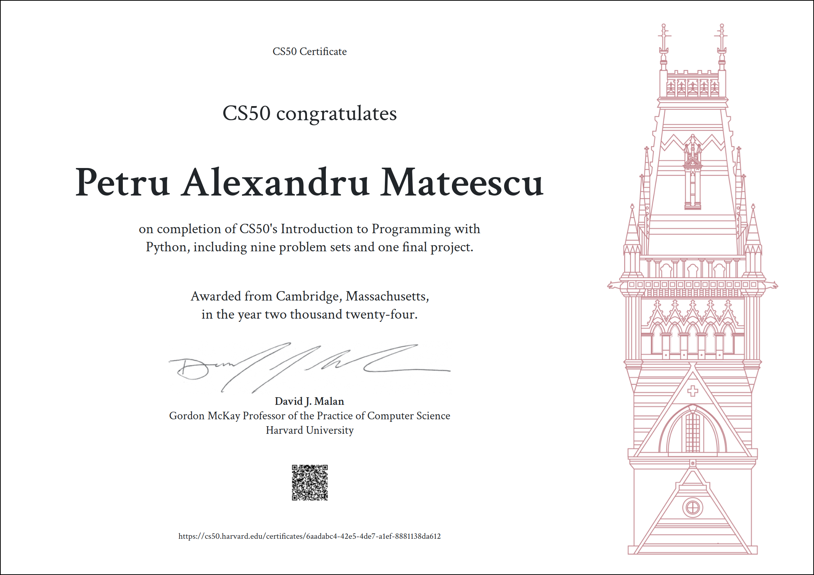

# CS50's Introduction to Programming with Python

Official course link: https://cs50.harvard.edu/python/2022/   
CS50P YouTube playlist: https://www.youtube.com/watch?v=OvKCESUCWII&list=PLhQjrBD2T3817j24-GogXmWqO5Q5vYy0V&pp=iAQB   
Python documentations: https://docs.python.org/3/   
Python Package Index documentation: https://pypi.org/   
Personal CS50P ChatGPT: https://chat.openai.com/c/68fb62eb-bddc-47ee-b7b8-cf9f0a7f0cc8   
CS50P Gradebook: https://cs50.me/cs50p

# CS50P Certificate

# Virtual Environment

Working with an environment for this course is highly recommended to keep workspace organized. For ease of understanding use the following commands (applicable on Windows OS; for Unix / macOS refer to [docs.python.org/../venv](https://docs.python.org/3/library/venv.html)) in your root folder (e.g. c:\path\to\CS50P\directory):
- *python.exe -m pip install --upgrade pip* (**optional**) to update pip to latest version.
- *python -m venv .venv* to create virtual environment.
- *.venv\Scripts\activate* to activate virtual environment.
- *pip install -r requirements.txt* to recreate the virtual environment.
- *pur -r .\requirements.txt* (**optional**) to update all requirements to latest versions.
- *pip freeze > requirements.txt* (**optional**) to update requirements.txt file if you install any other python package to your virtual environment.

# Problem Sets

## Necessities
Before every problem log into [cs50.dev](https://cs50.dev/), click on your terminal window, and execute *cd* by itself. You should find that your terminal window’s prompt resembles *$* symbol. After this, execute *mkdir 'directory|problem_name'* to create a folder with that name. Then execute *cd 'directory|problem_name'* to change directories into that folder. Finally execute *code 'directory|problem_name.py'* to create a python executable file with that name.

## Walk-around
I created a python executable named *before_psets.py directory|problem_name* that automatically creates directory and file with passed command-line argument as the name. If folder already exists or command-line argument is missing, program exits with error message. The created file is populated with a main() function template. This executable should be placed in root folder in your [cs50.dev](https://cs50.dev/).

## Disclaimer
Now you're ready to create **your personal** solution to problem sets, validate functionality with *check50* and *submit50* commands. Keeping in mind the course's policy on academic honesty. This repository is **my personal** interpretation and I made it public to help anyone in need with ideas. All that said, have fun coding!

# Lectures

## [Lecture 0: Functions, Variables](https://cs50.harvard.edu/python/2022/weeks/0/)

### [Concepts](https://cs50.harvard.edu/python/2022/notes/0/)
- [First Program](https://cs50.harvard.edu/python/2022/notes/0/#creating-code-with-python): *code prog_name.py* to create an empty python program -> *python prog_name.py* to run the program.
- [Functions](https://cs50.harvard.edu/python/2022/notes/0/#functions): are known actions that have side effects and can take arguments. Functions are used to modularize code (even within libraries). From the function's perspective the input variables are called *parameters*, but from the program's perspective that calls the function the input variables are called *arguments*. Positional parameters must be passed in the same order as they appear in the function signature, whereas named parameters can be passed in any order (defined by their specified name!). The position is not relevant for named parameters, but after them no positional parameter can be passed. Used functions: *print()*, *input()* (ALWAYS sanitize user input properly!). Functions can be called right after each other: *name = name.strip().title()*.
- [Bugs](https://cs50.harvard.edu/python/2022/notes/0/#bugs): are mistakes identified by the compiler with a cryptic, but useful message. Solve them to make a working or better program.
- [Variables](https://cs50.harvard.edu/python/2022/notes/0/#variables): are containers for values. Used data types: *int*, *float*, *str*. Used *str* methods: *isalpha()*, *strip()*, *title()*, *split()*. Used numeric methods: *int()*, *float()* type converters, *round()*.
- [Comments](https://cs50.harvard.edu/python/2022/notes/0/#comments): are notes for programmers (ignored by interpreter). Single-line comments are created using the "#" symbol. Multi-line strings are enclosed in triple quotes (""" ... """ or ''' ... '''). Docstrings are strings used to document modules, classes, functions, and methods. They are written as the first statement in the function, method, class, or module definition and are enclosed in triple quotes. Docstrings can be accessed programmatically via the __doc__ attribute and are a key part of Python's documentation system.
- [Escape Character](https://cs50.harvard.edu/python/2022/notes/0/#a-small-problem-with-quotation-marks): "\\" (*backslash*) used for special characters.
- [Formatting Strings](https://cs50.harvard.edu/python/2022/notes/0/#formatting-strings): *print(f"hello, {name}")* where *f* is a special indicator for Python to treat this string a special way. *{name}* is a variable in this case. See documentation for mini language!
- [Formatting Numbers](https://cs50.harvard.edu/python/2022/notes/0/#float-basics): separator for groups of three digits, starting from the decimal point and moving left: *print(f"{x:,}")*. Show decimals (2): *print(f"{x:.2f}")*. Show max (10) decimals, but exclude unnecessary "0": *print(f"{x:.10g}")*.
- [User Functions](https://cs50.harvard.edu/python/2022/notes/0/#def): created with *def* keyword and indentation to understand what is part of the function. To add default values to function parameters assign them in function declaration. A *main()* function is recommended to be created and called in a python program. A function can return one variable. This “passing back” value is called a *return* value.
- [Interactive mode](https://cs50.harvard.edu/python/2022/notes/0/#integers-or-int) is a feature of Python where code can be executed interactively in terminal. Enter *python* in terminal and ">>>" will appear for this feature. To exit use *exit()*.

### [Problem Set 0](https://cs50.harvard.edu/python/2022/psets/0/)
- [Indoor Voice](https://cs50.harvard.edu/python/2022/psets/0/indoor/): a python program that converts user input into lowercase.
- [Playback Speed](https://cs50.harvard.edu/python/2022/psets/0/playback/): a python program that outputs the same input, replacing each space with "...".
- [Making Faces](https://cs50.harvard.edu/python/2022/psets/0/faces/): a python program that changes ":)" to 🙂 and ":(" to 🙁.
- [Einstein](https://cs50.harvard.edu/python/2022/psets/0/einstein/): a python program that determines energy based on mass.
- [Tip Calculator](https://cs50.harvard.edu/python/2022/psets/0/tip/): a python program that calculates tips depending on dollar amounts and percentages.

## [Lecture 1: Conditionals](https://cs50.harvard.edu/python/2022/weeks/1/)

### [Concepts](https://cs50.harvard.edu/python/2022/notes/1/)
- [Conditionals](https://cs50.harvard.edu/python/2022/notes/1/#conditionals): allow the program to make decisions. *Mathematical operators* consist of "<", ">", "<=", ">=", "==" and "!=". *Boolean operators* consist of *and*, *or*, *not*.
- [if statements](https://cs50.harvard.edu/python/2022/notes/1/#if-statements): use boolean values (*true* or *false*) to decide whether or not to execute the code.
- [elif, else](https://cs50.harvard.edu/python/2022/notes/1/#control-flow-elif-and-else): *control flow* is the flow of decisions. To improve the code (and control flow) use *elif* and/or *else*.
- [Pythonic conditional](https://cs50.harvard.edu/python/2022/notes/1/#pythonic): represents the code almost like an English sentence *return True if condition==True else False* or *return condition==True*.
- [Match](https://cs50.harvard.edu/python/2022/notes/1/#match): *match* is used to conditionally run code that matches certain values. Is used in conjunction with *case*. The special case for everything else is *case _:*.

### [Problem Set 1](https://cs50.harvard.edu/python/2022/psets/1/)
- [Deep Thought](https://cs50.harvard.edu/python/2022/psets/1/deep/): a program that answers with "*Yes*" if input is "42", "forty two" or "forty-two" (case-insensitively), otherwise "*No*".
- [Home Federal Savings Bank](https://cs50.harvard.edu/python/2022/psets/1/bank/): program that outputs different amount of dollars based on user input: starting with "hello" than output "$0", starting with an "h" (but not "hello") than output "$20" (case-insensitively), otherwise output "$100".
- [File Extensions](https://cs50.harvard.edu/python/2022/psets/1/extensions/): program that prompts the user for the name of a file and then outputs that file’s media type from a list.
- [Math Interpreter](https://cs50.harvard.edu/python/2022/psets/1/interpreter/): program that interprets input as basic math function with two integer arguments and outputs the result as a floating-point value formatted to one decimal place.
- [Meal Time](https://cs50.harvard.edu/python/2022/psets/1/meal/): program that converts time, a str in 24-hour format, to the corresponding number of hours as a float and outputs what to eat when.

## [Lecture 2: Loops](https://cs50.harvard.edu/python/2022/weeks/2/)

### [Concepts](https://cs50.harvard.edu/python/2022/notes/2/)
- [While](https://cs50.harvard.edu/python/2022/notes/2/#while-loops): is a loop with unspecified number of iterations. It will stop if the condition of the loop has been fulfilled.
- [Continue, Break, Return](https://cs50.harvard.edu/python/2022/notes/2/#improving-with-user-input): are used to alter the flow of a loop. *Continue* explicitly tells Python to go to the next iteration of a loop. *Break*, on the other hand, tells Python to "break out" of a loop early before it has finished all of its iterations. *Return* performs similarly to *break*, but also finishes the function containing the loop.
- [List](https://cs50.harvard.edu/python/2022/notes/2/#more-about-lists): a python data type containing multiple values in one place in a contiguous block of memory. Create and assign a list: *my_list = [0, 1, 2]* or using constructor: *my_list=list((1, 2, 3))*.
- [For](https://cs50.harvard.edu/python/2022/notes/2/#for-loops): this loop iterates through a *list* of items. To generate a list of *int* use *range(X)* and it looks like *0, 1, ..., X-1*. The pythonic way of using a for loop if the variable *i* that stores the number of the iteration is not used is to replace it with "_".
- [Dictionaries](https://cs50.harvard.edu/python/2022/notes/2/#dictionaries): is a data structure that allows you to associate keys with values, similar to *hashtable* storing *key-value pairs*. To create a *dict* use *my_dict={ "key": "value", ... }*. Python has a special keyword **None** to specify there is no value associated with a key or absents of value.
- [Str concatenation](https://cs50.harvard.edu/python/2022/notes/2/#mario): is a pythonic way to create new strings by looping through current string *N* number of times and concatenating them (with "\*"): *new_str=current_str\*N*.  

### [Problem Set 2](https://cs50.harvard.edu/python/2022/psets/2/)
- [camelCase](https://cs50.harvard.edu/python/2022/psets/2/camel/): a program that prompts the user for the name of a variable in camel case and outputs the corresponding name in snake case.
- [Coke Machine](https://cs50.harvard.edu/python/2022/psets/2/coke/): program that prompts the user to insert a coin, one at a time, each time informing the user of the amount due. Once the user has inputted at least 50 cents, output how many cents in change the user is owed.
- [Just setting up my twttr](https://cs50.harvard.edu/python/2022/psets/2/twttr/): program that prompts the user for a str of text and then outputs that same text but with all vowels (A, E, I, O, and U) omitted, whether inputted in uppercase or lowercase.
- [Vanity Plates](https://cs50.harvard.edu/python/2022/psets/2/plates/): program that prompts the user for a vanity plate and then output Valid if meets all of the requirements or Invalid if it does not.
- [Nutrition Facts](https://cs50.harvard.edu/python/2022/psets/2/nutrition/): program that prompts consumers users to input a fruit (case-insensitively) and then outputs the number of calories in one portion of that fruit, per the FDA’s poster for fruits. Ignore any input that isn’t a fruit.

## [Lecture 3: Exceptions](https://cs50.harvard.edu/python/2022/weeks/3/)

### [Concepts](https://cs50.harvard.edu/python/2022/notes/3/)
- [Exceptions](https://cs50.harvard.edu/python/2022/notes/3/#exceptions): 
are things that go wrong within our code. For example: *SyntaxError* are those that require you to double-check that you typed in your code correction, *runtime errors* refer to those created by unexpected behavior within your code, *ValueError* occurs when a variable type is not used correctly, *NameError* describes a parameter not defined, *KeyboardInterrupt* is raised when ctrl+c from user/os stops the code from executing. As programmers, we should be defensive to ensure that our users are entering what we expected. **Never trust users to follow instructions or to comply to inputs or actions**.
- [Try](https://cs50.harvard.edu/python/2022/notes/3/#try): is a block that lets you test code for errors. It is used in conjunction with *except* and *else*.
-  [Pass](https://cs50.harvard.edu/python/2022/notes/3/#pass): is a statement that does nothing. It can be used when a statement is required syntactically but the program requires no action.
- Caller vs. Callee: A caller is a function that calls another function; a callee is a function that was called. Ex: *main()* calls *print()*; *main()* is the **caller** and *print()* is the **callee**.
- [Finally](https://docs.python.org/3/reference/compound_stmts.html#finally-clause): specifies a ‘cleanup’ handler. When a *return*, *break* or *continue* statement is executed in the *try* suite of a *try … finally* statement, the *finally* clause is also executed ‘on the way out.’ The finally block will always be executed if it is implemented in code, no matter if the try block raises an error or not.
- [With](https://docs.python.org/3/reference/compound_stmts.html#the-with-statement): is a statement used to wrap the execution of a block with methods defined by a context manager. It is typically used with file operations or similar contexts. For more info see [PEP 343 – The “with” Statement](https://peps.python.org/pep-0343/).
- [Raise](https://docs.python.org/3/reference/simple_stmts.html#the-raise-statement): evaluates the first expression as the exception object.

### [Problem Set 3](https://cs50.harvard.edu/python/2022/psets/3/)
- [Fuel Gauge](https://cs50.harvard.edu/python/2022/psets/3/fuel/): program that prompts the user for a fraction, formatted as X/Y, wherein each of X and Y is an integer, and then outputs, as a percentage rounded to the nearest integer, how much fuel is in the tank.
- [Felipe’s Taqueria](https://cs50.harvard.edu/python/2022/psets/3/taqueria/): program that enables a user to place an order, prompting them for items, one per line, until the user inputs control-d (which is a common way of ending one’s input to a program). After each inputted item, display the total cost of all items inputted thus far, prefixed with a dollar sign ($) and formatted to two decimal places. Treat the user’s input case insensitively. Ignore any input that isn’t an item. Assume that every item on the menu will be titlecased.
- [Grocery List](https://cs50.harvard.edu/python/2022/psets/3/grocery/): program that prompts the user for items, one per line, until the user inputs control-d (which is a common way of ending one’s input to a program). Then output the user’s grocery list in all uppercase, sorted alphabetically by item, prefixing each line with the number of times the user inputted that item. No need to pluralize the items. Treat the user’s input case-insensitively.
- [Outdated](https://cs50.harvard.edu/python/2022/psets/3/outdated/): program that prompts the user for a date, anno Domini, in month-day-year order, formatted like 9/8/1636 or September 8, 1636, wherein the month in the latter might be any of the values in a predetermined list. Then output that same date in YYYY-MM-DD format. If the user’s input is not a valid date in either format, prompt the user again.

## [Lecture 4: Libraries](https://cs50.harvard.edu/python/2022/weeks/4/)

### [Concepts](https://cs50.harvard.edu/python/2022/notes/4/)
- [Libraries](https://cs50.harvard.edu/python/2022/notes/4/#libraries): Python supports sharing functions or features through *libraries* and *modules*. Libraries encourage reusability in code. After *installing* any library, to use it you need to *import* it. Python will *import* whole library if the desired functions are not specified: *from lib import func_1, ...*. This is a way to improve code memory / space.
- [Random](https://cs50.harvard.edu/python/2022/notes/4/#random): is a library that comes with Python and implements pseudo-random number generators for various distributions. Functions used in this lecture include: *choice()*, *randint()*, *shuffle()*.
- [Statistics](https://cs50.harvard.edu/python/2022/notes/4/#statistics): is another built-in module that provides functions for calculating mathematical statistics of numeric (Real-valued) data. Function used in this lecture is *mean()*.
- [Command-Line Arguments](https://cs50.harvard.edu/python/2022/notes/4/#command-line-arguments): For increasing functionality, python supports command-line arguments passed directly at execution of the program. *sys* is a module that allows us to take arguments at the command line. *argv[]* is used to access data from command-line, where *argv[0]=program_name* or *argv[0]=path_to_program* (depending on OS). This functionality is used in conjunction with *try ... except* block and, sometimes, with *slicing* and *for* loops. Other used function in this lecture is *exit()*.
- [Slice](https://cs50.harvard.edu/python/2022/notes/4/#slice): is a subset of a data structure (*list* in this case). With this feature the compiler can consider a different start and end of the list.
- [Packages](https://cs50.harvard.edu/python/2022/notes/4/#packages): Python supports numerous powerful third-party libraries that add functionality. Implemented as folders, these are called *packages*. [PyPI](https://pypi.org/) is the place of all available third-party packages. To install a package use *pip install package_name --user*. Packages used in this lecture include: *cowsay*, *requests*.
- [APIs](https://cs50.harvard.edu/python/2022/notes/4/#apis): or **application program interfaces** allow you to connect to the code of others. *requests* is popular for calling HTTP methods like: *get*, *post* etc. Usually the output of APIs is a JSON (*JavaScript Object Notation*) and python comes with a *json* library built-in with *dumps()* function to print result more readable.
- [Making Your Own Libraries](https://cs50.harvard.edu/python/2022/notes/4/#making-your-own-libraries): to upload libraries to PyPI refer to [uploading documentation](https://packaging.python.org/en/latest/tutorials/packaging-projects/). To use local libraries make sure they are in the same folder as the program. Use __name__ keyword (if __name__ == "__main__") to divide functionality between main program and module.
- ANSI color escape codes: are used to show terminal output more clearly.

### [Problem Set 4](https://cs50.harvard.edu/python/2022/psets/4/)
- [Emojize](https://cs50.harvard.edu/python/2022/psets/4/emojize/): program that prompts the user for a str in English and then outputs the “emojized” version of that str, converting any codes (or aliases) therein to their corresponding emoji. 
- [Frank, Ian and Glen’s Letters](https://cs50.harvard.edu/python/2022/psets/4/figlet/): program that expects zero or two command-line arguments (zero if the user would like to output text in a random font or two if the user would like to output text in a specific font, in which case the first of the two should be *-f* or *--font*, and the second of the two should be the name of the font), prompts the user for a str of text or outputs that text in the desired font. If the user provides two command-line arguments and the first is not *-f* or *--font* or the second is not the name of a font, the program should exit via *sys.exit* with an error message.
- [Adieu, Adieu](https://cs50.harvard.edu/python/2022/psets/4/adieu/):  program that prompts the user for names, one per line, until the user inputs control-d. Assume that the user will input at least one name. Then bid adieu to those names, separating two names with one *and*, three names with two commas and one *and*, and *n* names with *n-1* commas and one *and*.
- [Guessing Game](https://cs50.harvard.edu/python/2022/psets/4/game/): program that prompts the user for a level, *n*. If the user does not input a positive integer, the program should prompt again; randomly generates an integer between 1 and *n*, inclusive, using the *random* module; prompts the user to guess that integer. If the guess is not a positive integer, the program should prompt the user again. If the guess is smaller than that integer, the program should output *Too small!* and prompt the user again. If the guess is larger than that integer, the program should output *Too large!* and prompt the user again. If the guess is the same as that integer, the program should output *Just right!* and exit.
- [Little Professor](https://cs50.harvard.edu/python/2022/psets/4/professor/): program that prompts the user for a level, *n*. If the user does not input *1*, *2*, or *3*, the program should prompt again; randomly generates ten (10) math problems formatted as *X + Y =*, wherein each of *X* and *Y* is a non-negative integer with *n* digits. No need to support operations other than addition (*+*); prompts the user to solve each of those problems. If an answer is not correct (or not even a number), the program should output *EEE* and prompt the user again, allowing the user up to three tries in total for that problem. If the user has still not answered correctly after three tries, the program should output the correct answer; the program should ultimately output the user’s score: the number of correct answers out of 10.
- [Bitcoin Price Index](https://cs50.harvard.edu/python/2022/psets/4/bitcoin/): program that expects the user to specify as a command-line argument the number of Bitcoins, *n*, that they would like to buy. If that argument cannot be converted to a *float*, the program should exit via *sys.exit* with an error message; queries the API for the CoinDesk Bitcoin Price Index at https://api.coindesk.com/v1/bpi/currentprice.json, which returns a JSON object, among whose nested keys is the current price of Bitcoin as a *float*; Outputs the current cost of *n* Bitcoins in USD to four decimal places, using *,* as a thousands separator.

## [Lecture 5: Unit Tests](https://cs50.harvard.edu/python/2022/weeks/5/)

### [Concepts](https://cs50.harvard.edu/python/2022/notes/5/)
- [Unit Tests](https://cs50.harvard.edu/python/2022/notes/5/#unit-tests): are a way of testing the code with various measurements (usually automatic testing).
- [Assert](https://cs50.harvard.edu/python/2022/notes/5/#assert): verifies the functionality of functions and if all are correct than no error messages will appear (no *AssertionError* raised). This approach is useful if functions will return something, otherwise it can't be tested with *assert*.
- [pytest](https://cs50.harvard.edu/python/2022/notes/5/#pytest): is a third-party library that allows you to unit test your program. Learn more in [Pytest’s documentation](https://docs.pytest.org/en/7.1.x/getting-started.html). It is possible to group testing files in folders, but a file named "__init__.py" is necessary to tell python this is a package.

### [Problem Set 5](https://cs50.harvard.edu/python/2022/psets/5/)
- [Testing my twttr](https://cs50.harvard.edu/python/2022/psets/5/test_twttr/): program that reimplements [Setting up my twttr](https://cs50.harvard.edu/python/2022/psets/2/twttr/) from Problem Set 2, restructuring the code as described. Implement one or more functions that collectively test your implementation of *shorten* function thoroughly.
- [Back to the Bank](https://cs50.harvard.edu/python/2022/psets/5/test_bank/): program that reimplements [Home Federal Savings Bank](https://cs50.harvard.edu/python/2022/psets/1/bank/) from Problem Set 1, restructuring the code as described. Implement three or more functions that collectively test your implementation of *value* function thoroughly.
- [Re-requesting a Vanity Plate](https://cs50.harvard.edu/python/2022/psets/5/test_plates/): program that reimplements [Vanity Plates](https://cs50.harvard.edu/python/2022/psets/2/plates/) from Problem Set 2, restructuring the code as described. Implement four or more functions that collectively test your implementation of *is_valid* function thoroughly.
- [Refueling](https://cs50.harvard.edu/python/2022/psets/5/test_fuel/): program that reimplements [Fuel Gauge](https://cs50.harvard.edu/python/2022/psets/3/fuel/) from Problem Set 3, restructuring the code as described. Implement two or more functions that collectively test your implementations of *convert* and *gauge* functions thoroughly.

## [Lecture 6: File I/O](https://cs50.harvard.edu/python/2022/weeks/6/)

### [Concepts](https://cs50.harvard.edu/python/2022/notes/6/)
- [File I/O](https://cs50.harvard.edu/python/2022/notes/6/#file-io): Program variables are volatile, so storing data in files is essential. *os* library is a builtin python file i/o handling module. It has many functions: *open()*, *close()*, *write()*, *read()*, *readlines()* and others.
- [open](https://cs50.harvard.edu/python/2022/notes/6/#open): Open files with appropriate type: *w*, *r*, *a*, ... Files are created automatically if they don't already exist. The default file location is the same as the program that uses them.
- [with](https://cs50.harvard.edu/python/2022/notes/6/#with): is the pythonic way to handle file objects and automate the closing of a file.
- [csv](https://cs50.harvard.edu/python/2022/notes/6/#csv): means “comma separated values” and is a python builtin library with many functionalities like: *reader()*, *DictReader()*, *writer()*, *DictWriter()*, *writerow()*.   
- Sorting list/dict from file or local list/dict is demonstrated in this course.
- Searching dict by key or value is demonstrated in this course.
- lambda functions for sorting are demonstrated in this course. The syntax is *lambda parameter_of_lambda_func: return_value_of_lambda_func*.
- [pillow (PIL)](https://cs50.harvard.edu/python/2022/notes/6/#binary-files-and-pil): is library for image/video processing and binary files. In this course *save()* function is demonstrated.

### [Problem Set 6](https://cs50.harvard.edu/python/2022/psets/6/)
- [Lines of Code](https://cs50.harvard.edu/python/2022/psets/6/lines/): program that expects exactly one command-line argument, the name (or path) of a Python file, and outputs the number of lines of code in that file, excluding comments and blank lines. If the user does not specify exactly one command-line argument, or if the specified file’s name does not end in *.py*, or if the specified file does not exist, the program should instead exit via *sys.exit*.
- [Pizza Py](https://cs50.harvard.edu/python/2022/psets/6/pizza/): program that expects exactly one command-line argument, the name (or path) of a CSV file in Pinocchio’s format, and outputs a table formatted as ASCII art using *tabulate*, a package on PyPI at https://pypi.org/project/tabulate. Format the table using the library’s *grid* format. If the user does not specify exactly one command-line argument, or if the specified file’s name does not end in *.csv*, or if the specified file does not exist, the program should instead exit via *sys.exit*.
- [Scourgify](https://cs50.harvard.edu/python/2022/psets/6/scourgify/): program that expects the user to provide two command-line arguments (the name of an existing CSV file to read as input, whose columns are assumed to be, in order, *name* and *house*, and the name of a new CSV to write as output, whose columns should be, in order, *first*, *last*, and *house*); converts that input to that output, splitting each *name* into a *first* name and *last* name. Assume that each student will have both a first name and last name. If the user does not provide exactly two command-line arguments, or if the first cannot be read, the program should exit via *sys.exit* with an error message.
- [CS50 P-Shirt](https://cs50.harvard.edu/python/2022/psets/6/shirt/): program that expects exactly two command-line arguments: in *sys.argv[1]*, the name (or path) of a JPEG or PNG to read (i.e., open) as input; in *sys.argv[2]*, the name (or path) of a JPEG or PNG to write (i.e., save) as output. The program should then overlay shirt.png (which has a transparent background) on the input after resizing and cropping the input to be the same size, saving the result as its output.

## [Lecture 7: Regular Expressions (regex)](https://cs50.harvard.edu/python/2022/weeks/7/)

### [Concepts](https://cs50.harvard.edu/python/2022/notes/7/)
- [Regular Expressions](https://cs50.harvard.edu/python/2022/notes/7/#regular-expressions): or “regex” is a pattern to match data for validation / cleaning / creation purposes. Example is validating input from user (email address, password, age etc.). In python there are builtin modules and functions to check regex patterns: *re* with *search()*, *sub()*, *match()*, *fullmatch()* functions to find and format data. More about info in [regex documentation](https://docs.python.org/3/library/re.html) about syntax, special characters, flags, exceptions etc.
- Walrus operator *:=* assigns a value from right to left and allows us to ask a boolean question at the same time.
- Online tools to create, test, visualize regex (eg. [regex101.com](https://regex101.com/), [debuggex.com](https://www.debuggex.com/)).
   
### [Problem Set 7](https://cs50.harvard.edu/python/2022/psets/7/)
- [NUMB3RS](https://cs50.harvard.edu/python/2022/psets/7/numb3rs/): function called *validate* that expects an IPv4 address as input as a *str* and then returns *True* or *False*, respectively, if that input is a valid IPv4 address or not.
- [Watch on YouTube](https://cs50.harvard.edu/python/2022/psets/7/watch/): function called *parse* that expects a *str* of HTML as input, extracts any YouTube URL that’s the value of a *src* attribute of an *iframe* element therein, and returns its shorter, shareable *youtu.be* equivalent as a *str*. Expect that any such URL will be in one of the formats below. Assume that the value of *src* will be surrounded by double quotes. And assume that the input will contain no more than one such URL. If the input does not contain any such URL at all, return *None*.
- [Working 9 to 5](https://cs50.harvard.edu/python/2022/psets/7/working/): function called *convert* that expects a *str* in any of the 12-hour formats below and returns the corresponding *str* in 24-hour format (i.e., *9:00 to 17:00*). Expect that *AM* and *PM* will be capitalized (with no periods therein) and that there will be a space before each. Assume that these times are representative of actual times, not necessarily 9:00 AM and 5:00 PM specifically. Raise a *ValueError* instead if the input to *convert* is not in either of those formats or if either time is invalid (e.g., *12:60 AM*, *13:00 PM*, etc.). But do not assume that someone’s hours will start ante meridiem and end post meridiem; someone might work late and even long hours (e.g., *5:00 PM to 9:00 AM*).
- [Regular, um, Expressions](https://cs50.harvard.edu/python/2022/psets/7/um/): function called *count* that expects a line of text as input as a *str* and returns, as an *int*, the number of times that “um” appears in that text, case-insensitively, as a word unto itself, not as a substring of some other word. For instance, given text like *hello, um, world*, the function should return *1*. Given text like *yummy*, though, the function should return *0*.
- [Response Validation](https://cs50.harvard.edu/python/2022/psets/7/response/): program that prompts the user for an email address via *input* and then prints *Valid* or *Invalid*, respectively, if the input is a syntactically valid email address. You may not use *re*. And do not validate whether the email address’s domain name actually exists.

## [Lecture 8: Object-Oriented Programming](https://cs50.harvard.edu/python/2022/weeks/8/)

### [Concepts](https://cs50.harvard.edu/python/2022/notes/8/)
- Python's programming paradigms (coding patterns):
  - **procedural programming**: execute code step by step or specifies the steps a program must take to reach a desired state. Examples: *Pascal*, *C*, *C++*, *Java*.
  - **functional programming**: treats programs as evaluating mathematical functions and avoids state and mutable data. Based on powerful functions and lambda. Examples: *Lisp*, *Haskell*, *Python*.
  - **[OOP](https://cs50.harvard.edu/python/2022/notes/8/#object-oriented-programming)**: organizes programs around data/objects. Based on abstraction (means hiding the implementation), classes, encapsulation, methods, overloading, inheritance etc. Examples: *Python*, *Java*, *C++*, *C#*, *Ruby*.
  - **imperative programming**: software development paradigm where Functions are implicitly coded in every step required to solve a problem. Examples: *Pascal*, *C*, *C++*, *Java*.
  - **declarative programming**: focuses on the logic of computation neglecting the control flow. Examples: *SQL*, *QML*.
  - **structured programming**: a kind of imperative programming focusing on modular programming. Examples: *C*, *C++*, *C#*, *Ruby*, *Pearl*.
- *tuples* are a sequence of values. Compared to *list*, *tuple* is immutable (can't be modified). Advantage is programming defensively. If you try to change tuple's values, than *TypeError* is raised.  
- [Classes](https://cs50.harvard.edu/python/2022/notes/8/#classes): like a blueprint for objects. Classes invent data types. [Classes' documentation](https://docs.python.org/3/tutorial/classes.html) For simplicity, python offers "..." which means that code will be finished later (like *pass* for functions). Classes have attributes (variables that allow values to be specified inside them) which accessing syntax is ".". Attributes can be any data type (str, int, float, list, tuple, dict, other). To use a class create objects with all functionalities, a name and exists in computer's memory. Objects are instantiations of that class. OOP encourages you to encapsulate all the functionality of a class within the class definition. By default, classes are mutable, but can be protected in code.
- Data correctness is possible by standardizing attribute value. Check values in *constructor* method. *Methods* are classes functions that behave in special ways (examples: *constructor*, *setter*, *getter*). The *constructor* is defined by instance method *def \__init__(self,...)* which initialize classes attributes. Syntax "\__" is called "dunder" (double "under"). Many methods refers to the current object *self* that called them. *Self* is strictly used inside classes and not in other functions with which objects interact. Another convention is *\__init__* must use same names of attributes as the parameters calling it. Data validation is addressed by raising errors. This will stop and clean the program. Also, values are checked first and than assigned to object's attributes, compared to dictionaries where values go in no matter what. This provides control over value correctness.
- To print/get values of object attributes, python has *def \__str__(self)* method that has only one argument *self* and returns 'str' type.
- Property of a class is an feature that prevents programmers to change values of attributes to ensure more control. Properties are defined using function '[decorators](https://cs50.harvard.edu/python/2022/notes/8/#decorators)', which begin with *@*. These modify the behavior of that function. Examples: *@property* defines how some attribute of our class should be set and retrieved. This said, classes can have methods for *getter* (accepts only one argument *self* and is specified with *@property*) and *setter* (accepts two arguments *self*, *actual_value* and is specified wit *@attribute.setter*). These are always called and prevent users to access attributes directly. Attributes and functions with same name will collide, so the convention is to prefix attribute with '\_'. This is not used in *\__init__* because we want python to call getter and setter and not the attribute itself, maintaining error checking and correctness. That means a user can change the instance variable by just addressing it with '_' because python doesn't provide the level of protection like Java using special mechanisms (like private, public, protected etc.). Python implements the *honor* system, not *visibility* system like Java.
- [Examples](https://cs50.harvard.edu/python/2022/notes/8/#connecting-to-previous-work-in-this-course) of classes implemented in python: int, str, list, dict, other.
- Example of instance methods [self]: *\__init__* => initializer, *@property* => getter, *@attribute_name.setter* => setter, *\__str__* => print method, *\__add__* => operator overloading.
- [Class methods](https://cs50.harvard.edu/python/2022/notes/8/#class-methods) [cls]: associates functions with the class itself, not the object. In other words, it is not relevant to have multiple objects with that function, only one. No need to instantiate an object, so no *\__init__* method required. *self* is replaced with *cls* and *@classmethod* is specified to create an object by calling that method without the object in first place.
- Besides instance methods and class methods, python offers other types of methods like *@[staticmethod](https://cs50.harvard.edu/python/2022/notes/8/#static-methodsC)*.
- [Inheritance](https://cs50.harvard.edu/python/2022/notes/8/#inheritance): feature of OOP where a class “inherits” methods, variables, and attributes from another class (named superclass). To define *child* class that inherits *parent* class use syntax *class Child(Parent)*. To use methods/variables call *super().\__init__(...)* that runs *\__init__* method of *parent*. Example of class inheritance is [exception-hierarchy](https://docs.python.org/3/library/exceptions.html#exception-hierarchy).
- [Operator Overloading](https://cs50.harvard.edu/python/2022/notes/8/#operator-overloading): some operators can be “overloaded” such that they can have more abilities beyond simple arithmetic. *def \__add__(self, other)* method allows for defining addition of values from user created data types like instances of classes. In this case *self* is what is on the left of the '+' operand and *other* is what is right of the '+'.

### [Problem Set 8](https://cs50.harvard.edu/python/2022/psets/8/)
- [Seasons of Love](https://cs50.harvard.edu/python/2022/psets/8/seasons/): program that prompts the user for their date of birth in *YYYY-MM-DD* format and then sings prints how old they are in minutes, rounded to the nearest integer, using English words instead of numerals, without any and between words. Since a user might not know the time at which they were born, assume, for simplicity, that the user was born at midnight (i.e., 00:00:00) on that date. And assume that the current time is also midnight. In other words, even if the user runs the program at noon, assume that it’s actually midnight, on the same date.
- [Cookie Jar](https://cs50.harvard.edu/python/2022/psets/8/jar/): implement a *class* called *Jar* with these methods: __init__ should initialize a cookie jar with the given *capacity*, which represents the maximum number of cookies that can fit in the cookie jar. If *capacity* is not a non-negative *int*, though, __init__ should instead raise a *ValueError*; __str__ should return a *str* with *n* 🍪, where *n* is the number of cookies in the cookie jar; *deposit* should add *n* cookies to the cookie jar. If adding that many would exceed the cookie jar’s capacity, though, *deposit* should instead raise a *ValueError*; *withdraw* should remove *n* cookies from the cookie jar. If there aren’t that many cookies in the cookie jar, though, *withdraw* should instead raise a *ValueError*; *capacity* should return the cookie jar’s capacity; *size* should return the number of cookies actually in the cookie jar, initially *0*. Additionally implement four or more functions that collectively test your implementation of Jar class thoroughly.
- [CS50 Shirtificate](https://cs50.harvard.edu/python/2022/psets/8/shirtificate/): program that prompts the user for their name and outputs, using [fpdf2](https://pypi.org/project/fpdf2/), a CS50 shirtificate in a file called *shirtificate.pdf*, with these specifications: the orientation of the PDF should be Portrait; the format of the PDF should be A4, which is 210mm wide by 297mm tall; the top of the PDF should say “CS50 Shirtificate” as text, centered horizontally; the shirt’s image should be centered horizontally and the user’s name should be on top of the shirt, in white text.

## [Lecture 9: Et Cetera](https://cs50.harvard.edu/python/2022/weeks/9/)

### [Concepts](https://cs50.harvard.edu/python/2022/notes/9/)
- [set](https://cs50.harvard.edu/python/2022/notes/9/#set): data type similar to list, but eliminates duplicates automatically. To use this call constructor *set()* and *add()* method to insert elements in set vs. *append()* in list.
- [Global Variables](https://cs50.harvard.edu/python/2022/notes/9/#global-variables): are created outside of any function and accessible to any function. If used without *global* keyword an *Unbound Local Error* appears. In python local variables have priority vs. global variables. The recommendation is to create a class instead of a global variable because instance variables are accessible to all the methods of the class utilizing *self*, besides other benefits. Also don't name global and local variables with the same name because it is hard to read, debug and maintain. 
- [Constant Variables](https://cs50.harvard.edu/python/2022/notes/9/#constants): more like variables that are unchangeable, altho Constants allow one to program defensively and reduce the opportunities for important values to be altered. Constants are typically denoted by capital variable names and are placed at the top of our code. Though this looks like a constant, in reality, Python actually has no mechanism to prevent us from changing that value within our code! Instead, you’re on the honor system: if a variable name is written in all caps, just don’t change it! More than this, a class can abstract the implementation and the constant is less visible and somewhat more protected.
- [Type Hints](https://cs50.harvard.edu/python/2022/notes/9/#type-hints): python is a dynamically typed engine (vs. strongly typed like C/C++/Java), so no need to tell variable type. To reduce bugs and mistakes python accepts hints on variables / function return types. Packages like *mypy* can be used to verify correctness of a program. Syntax is *"var: type"* and *"def function(...) -> return_type"*.
- [Docstrings](https://cs50.harvard.edu/python/2022/notes/9/#docstrings): document strings which is a standard way of commenting your function’s purpose. Comments conventions: three double quotes, description, parameters types and description, possible raised errors, return type and description. Established tools, such as [Sphinx](https://www.sphinx-doc.org/en/master/index.html), can be used to parse docstrings and automatically create documentation for us in the form of web pages and PDF files such that you can publish and share with others. All af these are not created by python, rather adopted. This is a convention named *Restructured Text*. Docstrings can also be used for testing different inputs with some tools.
- [argparse](https://cs50.harvard.edu/python/2022/notes/9/#argparse): more than sys.argv, *argparse* is a library that handles all the parsing of complicated strings of command-line arguments. An object called *parser* is created from an *ArgumentParser* class. That class’s *add_argument* method is used to tell *argparse* what arguments we should expect from the user when they run our program. Finally, running the parser’s *parse_args* method ensures that all of the arguments have been included properly by the user. They can get some information about the proper usage of our code when they fail to use the program correctly (using *help* argument and/or providing default use-cases). The convention is to use one '-' for one char arguments (*\-initial*) and '--' for a word (*\-\-word*).
- [Unpacking](https://cs50.harvard.edu/python/2022/notes/9/#unpacking): a python technique for extracting / splitting information into multiple variables from a string, list, set or other data type. Special operators: '\*' for automatically unpacking a list or tuple (but not for set) and '\*\*' for dictionaries. For functions passing data can be done with named parameters where the order doesn't count. These operators (\* and \*\*) are used to indicate variable number of arguments with these placeholders (by default, but can be changed) *\*args* -> how many arguments the function should expect, *\*\*kwargs* -> key arguments called by their name. In python, *\*args* is a tuple and *\*\*kwargs* is a dictionary.
- Python supports many programming models:
  - procedural (the code is executed top to bottom, left to right defining some functions / procedures, variables, having side effects, assigning values etc.).
  - OOP (with many examples of data structures being objects from classes that encapsulate data and functions).
  - functional (functions are powerful and, usually, don't have side effects, but are self contained, take inputs and return values): lambda functions, [map](https://cs50.harvard.edu/python/2022/notes/9/#map) applies the same function on multiple elements, [filter](https://cs50.harvard.edu/python/2022/notes/9/#filter) applies a function (that must return True or False) on an iterable and returns a subset of the iterable for which a certain condition is true.
- [List Comprehension](https://cs50.harvard.edu/python/2022/notes/9/#list-comprehensions): allow you to create a list on the fly in one elegant one-liner. [Dictionary Comprehension](https://cs50.harvard.edu/python/2022/notes/9/#dictionary-comprehensions) the same idea behind list comprehensions applied to dictionaries. The difference is in operators: '[]' for list and '{}' for dictionary.
- [Enumerate](https://cs50.harvard.edu/python/2022/notes/9/#enumerate): presents the index and the value of enumerable one at a time.
- [Generators and Iterators](https://cs50.harvard.edu/python/2022/notes/9/#generators-and-iterators): a way to protect against your system running out of resources. Generators return data a little bit of a time even if the whole data generated is massive. Generator functions are using *yield* statement.
- TTS (text-to-speech) pyttsx4 module is demonstrated in this course.

### [Final Project](https://cs50.harvard.edu/python/2022/project/)
- The final project is an interactive trivia quiz game with a graphical user interface. Players can select the category, number of questions, and difficulty level. The trivia questions are sourced from the Open Trivia Database and presented with multiple-choice options and graphic elements for an enhanced experience.
- More details about functionalities, implementation and testing are found in *Project/README.md* and *Project/presentation.ppsx* files.
